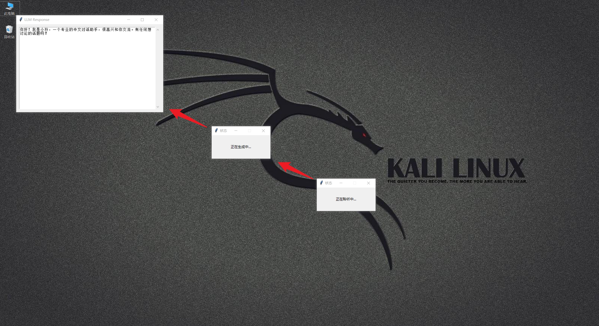

# ChatToPC（桌面智能问答语音助手）

​	一个在Windows运行的AI对话助手项目。它会在用户按住空格键时录制音频，使用本地 音频转文字API（SenseVoice）转录音频，将文本发送给大语言模型（LLM，如 OpenAI 的 GPT 系列），然后可以选择性地在弹窗中显示回复，和/或使用文本转语音（TTS）将回复朗读出来。
**制作不易，对你有帮助的话请stars**。


## 功能特性

* **按键说话 (Push-to-Talk):** 按住空格键进行录音。
* **音频录制:** 使用 `sounddevice` 和 `numpy` 进行录音，`soundfile` 保存 WAV 文件。
* **语音转录:** 将录制的音频文件路径发送到可配置的转录 API 端点。
* **LLM 交互:** 使用 `langchain-openai` 与 OpenAI 兼容的 API 进行交互（包括 OpenAI 官方 API ）。
* **文本转语音 (TTS):** 使用 `pyttsx3` 和 `sounddevice` 朗读 LLM 的回复。
* **图形界面 (GUI) 通知:**
    * 使用 `tkinter` 显示临时的状态弹窗，如“正在聆听中...”、“正在生成中...”。
    * 可选地使用 `tkinter` 在一个独立的弹窗中显示最终的 LLM 回复。
* **高度可配置:** 所有主要设置（API 密钥、URL、设备索引、功能开关等）均可通过 `.env` 文件进行配置。

## 依赖项

* Python 3.10 或更高版本
* 所需的 Python 库:
    * `sounddevice`: 用于音频输入/输出。
    * `numpy`: 用于处理数值音频数据。
    * `keyboard`: 用于全局空格键监听（需要特殊权限）。
    * `soundfile`: 用于读/写 WAV 文件。
    * `requests`: 用于调用 API（例如语音转录）。
    * `python-dotenv`: 用于从 `.env` 文件加载配置。
    * `langchain-openai`: 用于简化与 OpenAI/兼容 LLM 的交互。
    * `openai`: LLM 交互的底层库。
    * `pyttsx3`: 用于文本转语音合成。
    * `tkinter`: （通常 Python 内置）用于 GUI 弹窗。

## 安装与设置

1.  **环境要求:**
    
    * 确保已安装 Python 3.10 或更高版本。
    
2.  **克隆或下载代码:**
    ```bash
    git clone https://github.com/bossdong955/ChatToPC.git # 或者下载脚本文件
    cd ChatToPC    # 进入项目目录
    ```

3.  **安装 Python 依赖:**
    强烈建议使用 Python Conda虚拟环境：
    ```
    # 1. 修改虚拟环境名称
    修改`conda_requirements.yml`中`my_env`为你的环境名称
    
    2. 创建虚拟环境
    conda env create -f conda_requirements.yml
    
    # 2. 激活环境
    conda activate my_env
    ```

4.  **配置 `.env` 文件:**
    在项目根目录下存在一个名为 `.env` 的文件。

    ```dotenv
    # .env file

    # --- Audio Settings ---
    SAMPLERATE=44100
    CHANNELS=1
    # AUDIO_INPUT_DEVICE= # Leave empty for system default, or use device index (e.g., 1) or name (e.g., "Microphone (Realtek Audio)")

    # --- Recording Settings ---
    AUDIO_SAVE_DIR=./audio/ # 此项不要修改
    FILENAME_BASE=recorded_audio # 音频文件前缀
    RECORD_START_DELAY=0.7 # 按下空格多久开始录音

    # 音频转文本接口地址
    # 与transcribe_audio.py同步
    SENSEVOICE_API_URL="http://localhost:8001/transcribe"
    
    # OpenAI格式接口密钥
    OPENAI_API_KEY="your openai api key"
    
    # OpenAI格式接口模型名称
    OPENAI_MODEL_NAME="your openai model name"

    # # OpenAI格式接口URL
    OPENAI_BASE_URL="your openai base url"
    
    # 开启阅读功能时使用的提示词
    SYSTEM_PROMPT_CHAT="你是一个专业的中文对话助手，名叫小玲，用自然流畅的中文进行交流，语气友好且信息准确。回答时注意：
    
    语言风格：使用标准普通话，语法正确，避免生硬翻译腔。
    
    交互方式：保持对话连贯性，能处理多轮对话，对模糊提问礼貌追问。
        
    知识表达：复杂概念用简单例子说明，不确定时如实告知，避免绝对化表述。
    
    安全策略：遇到敏感话题委婉拒绝，不提供医疗、法律等专业建议。
    
    首轮响应示例：
    ‘你好！很高兴和你聊天，有什么想讨论的话题吗？’
    
    特点：
    ✅ 简洁：只保留核心生成要求，无冗余描述
    ✅ 可控：明确语言、交互、知识、安全四维度
    ✅ 灵活：适合各类GPT模型，无需额外调整"
    
    
    # 未开启阅读模式使用的提示词
    SYSTEM_PROMPT="请使用中文回答"
    
    # Control features (True/False)
    # 是否弹窗显示LLM响应
    SHOW_LLM_RESPONSE_POPUP=True
    
    # 弹窗是否自动关闭
    POPUP_AUTO_CLOSE=True
    
    # 是否开启阅读功能
    # <现阶段阅读过程中请不要手动关闭弹窗>
    ENABLE_TTS=True
    ```


5.  **权限 (Keyboard 库):**
    `keyboard` 库需要提升权限才能全局监听按键：
    * **Windows:** 以管理员身份运行脚本或终端。

6.  **外部服务:**
    * 确保你的转录 API 服务（如果配置了 `SENSEVOICE_API_URL`）正在运行，并且脚本可以访问配置的 URL。
    * 确保你的 LLM API 服务（如果为本地模型配置了 `OPENAI_BASE_URL`）正在运行，并且脚本可以访问。

## 使用方法

1.  **运行脚本:**
    ```bash
    # 音频转文本脚本
    python transcribe_audio.py
    
    # 主程序脚本
    python main.py
    ```
2.  **交互:**
    
    * 脚本启动后会打印当前的配置信息和可用的音频设备。
    * **按住 `空格键`**。等待 `RECORD_START_DELAY` 设置的延迟时间（例如 0.3 秒）。
    * 屏幕上会出现一个小的状态弹窗，显示“正在聆听中...”。此时请清晰地说话。
    * **松开 `空格键`**。“正在聆听中...”弹窗会关闭。
    * 音频被保存并发送进行转录。
    * 在等待 LLM 回复时，会出现一个状态弹窗，显示“正在生成中...”。
    * 当 LLM 回复后：
        * “正在生成中...”弹窗关闭。
        * 回复文本会打印在控制台。
        * 如果 `SHOW_LLM_RESPONSE_POPUP=True`，回复会显示在一个较大的弹窗中。
        * 如果 `ENABLE_TTS=True`，回复会被朗读出来。
        * 如果 `POPUP_AUTO_CLOSE=True` 且 `ENABLE_TTS=True`，LLM 回复弹窗会在 TTS 朗读完毕后自动关闭。否则，需要用户手动点击弹窗的“X”按钮关闭。
    * 脚本会打印“按住空格开始新的录音。”，表示已准备好进行下一次交互。
3.  **退出:** 在运行脚本的终端中按 `Ctrl+C`。

## 配置项详解

所有设置通过 `.env` 文件控制。如果文件中缺少某个变量，脚本将使用代码中指定的默认值。

| 变量名                    | 描述                                                                                                 | 默认值 (`.env`中未设置时)             | 示例                       |
| :------------------------ | :--------------------------------------------------------------------------------------------------------- | :------------------------------------ | :------------------------- |
| `SAMPLERATE`              | 音频采样率 (Hz)。                                                                                        | `44100`                               | `16000`                    |
| `CHANNELS`                | 音频通道数 (1=单声道, 2=立体声)。                                                                        | `1`                                   | `1`                        |
| `AUDIO_INPUT_DEVICE`      | 指定音频输入设备，可通过索引(整数)或名称(字符串)。留空表示使用系统默认。                                   | `None` (系统默认)                     | `1` 或 `"麦克风名称"`      |
| `AUDIO_SAVE_DIR`          | 保存录音文件的目录。                                                                                     | `./audio/`                            | `/tmp/voice_recordings/`   |
| `FILENAME_BASE`           | 保存录音文件的基础名称 (会自动添加时间戳)。                                                              | `recorded_audio`                      | `my_recording`             |
| `RECORD_START_DELAY`      | 按下空格键后，开始录音前的延迟时间（秒）。                                                                 | `0.3`                                 | `0.5`                      |
| `SHOW_LLM_RESPONSE_POPUP` | 是否在 Tkinter 弹窗中显示最终的 LLM 回复 (`True`/`False`)。                                                | `True`                                | `False`                    |
| `POPUP_AUTO_CLOSE`        | TTS 朗读完毕后是否自动关闭 LLM 回复弹窗 (`True`/`False`)。仅在 `ENABLE_TTS` 为 `True` 时生效。                | `True`                                | `False`                    |
| `ENABLE_TTS`              | 是否启用 LLM 回复的文本转语音 (TTS) 输出 (`True`/`False`)。                                                | `True`                                | `False`                    |
| `SENSEVOICE_API_URL`      | SenseVoice 兼容的转录 API 端点 URL。                                                                       | `http://localhost:8001/transcribe`    | `http://your-api-ip:port/` |
| `OPENAI_API_KEY`          | **必需。** 你的 OpenAI 或兼容服务的 API 密钥。                                                               | `None`                                | `"sk-..."`                 |
| `OPENAI_BASE_URL`         | 可选。OpenAI 兼容 API 的基础 URL (例如本地 LLM 代理)。留空使用 OpenAI 官方 API。                           | `None`                                | `http://localhost:11434/v1`|
| `OPENAI_MODEL_NAME`       | 要使用的具体 LLM 模型名称。                                                                               | `gpt-4o-mini`                         | `gpt-3.5-turbo`            |
| `SYSTEM_PROMPT_CHAT`      | 用于指导 LLM 行为的系统提示语。                                                                            | (见脚本中默认值)                        | `"你是一个乐于助人的AI助手..."` |

## 问题排查

* **`keyboard` 权限错误**: 以管理员身份 (Windows) 运行。
* **音频设备错误 (`PortAudioError`)**:
    * 检查系统是否选择了正确的音频输入设备，或者是否在 `.env` 中正确配置了 `AUDIO_INPUT_DEVICE`。
    * 运行脚本一次，查看启动时打印的可用设备列表及其索引/名称。
    * 确保 `portaudio` 库（或等效库）已正确安装。
* **API 错误 (ConnectionError, Timeout, 401 Unauthorized 等)**:
    * **转录 API:** 验证 `SENSEVOICE_API_URL` 是否正确，以及服务是否正在运行且可访问。
    * **LLM API:**
        * 验证 `OPENAI_API_KEY` 是否正确且有效。
        * 如果使用了 `OPENAI_BASE_URL`，验证其是否正确，以及本地服务/代理是否正在运行且可访问。
        * 检查 API 提供商是否有速率限制或服务器问题。
* **TTS 错误:** 确保 `pyttsx3` 安装正确，并且任何必要的 TTS 引擎后端可用。

## 许可证

本项目采用 Apache 许可证 - 详情请参阅 [LICENSE](LICENSE) 文件。
